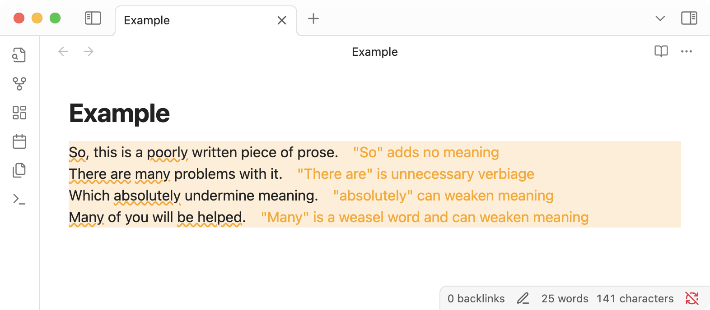

# Write Good

An Obsidian plugin that integrates [write good](https://github.com/btford/write-good), a linter for English prose and improving writing style. 

## Features

- Highlights writing issues in your notes
- Suggests improvements for:
  - Passive voice
  - Weasel words
  - Unnecessary words
  - Complex phrases
  - And more...

## Installation

### From Obsidian Community Plugins

1. Open Obsidian Settings
2. Go to Community Plugins and turn off Safe Mode
3. Click Browse and search for "Write Good"
4. Install the plugin
5. Enable the plugin in your Community Plugins settings

### Manual Installation

1. Navigate to the latest release from the [Releases page](https://github.com/markahesketh/write-good-obsidian/releases)
2. Download `main.js`, `manifest.json`, and `style.css` from the latest release
3. Move these files into your Obsidian vault's `.obsidian/plugins/write-good/` directory
4. Reload Obsidian
5. Enable the plugin in your Community Plugins settings

## Usage

1. Open any note in your vault
2. Writing suggestions will automatically appear as you type

## Development

1. Clone this repository to your machine
2. Run `bin/npm install` to install dependencies
3. Run `bin/npm run dev` to start compilation in watch mode
4. Copy or symlink the repository to your Obsidian vault's plugins folder:
   `.obsidian/plugins/write-good-obsidian/`

## Contributing

Bug reports and pull requests are welcome on GitHub at https://github.com/markahesketh/write-good-obsidian.

## License

This plugin is available as open source under the terms of the [MIT License](LICENSE).